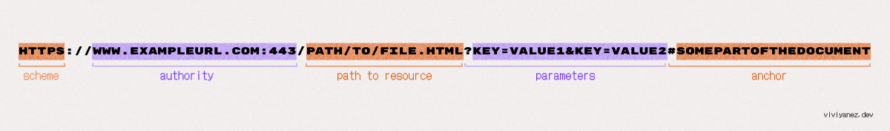

## Finding a Resource: URLs

Each resource stored in a server can be located by clients using its valid associated URL. 

The following is an example of a valid URL:

let’s see in detail each one of its parts:

Scheme: 

    The first part of an URL indicates the protocol that should be used to retrieve the resource. Websites use the HTTP and the HTTPS protocol, but we’ll see more details about this later. The : after the scheme is what separates it from the next part of the URL.

Authority: 

    this part is composed by the domain name and the port number separated by a colon. The port is only mandatory when the standard ports of the HTTP protocol (80 for HTTP and 443 for HTTPS) are not being used by the web server. The // before the domain name indicates the beginning of the authority.

Path to resource: 

    this is the abstract or physical path to the resource in the web server.

Parameters: 

    a set of key/value pairs that add extra options to apply to the returning the requested resource. They are separated by a & and each web server has its own way to handle parameters. This section starts with ?.

Anchor: 

    This section, if present, starts by a # and is handled by the browser to display a specific part of the returned document. For example, it can point to a specific section in a HTML document.